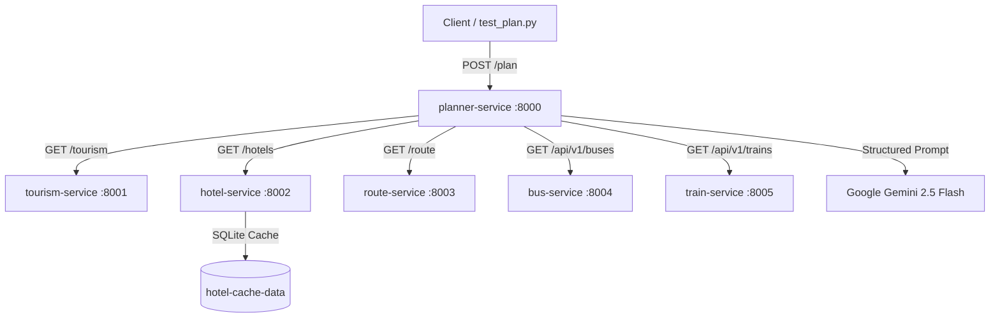

# 🧭 Dream Destiny — AI Travel Planner


An intelligent, multi-service travel planning platform that orchestrates real-time tourism, accommodation, transport, and routing data to generate grounded, optimized, day-by-day itineraries.

---

## 🏛️ Architecture & Services

The platform follows a modular microservice architecture. Specialized domain services fetch verified provider data, while the **Planner Service** coordinates data aggregation and invokes a constrained AI planning agent.



| Service | Port | Responsibility | Data Source / Engine |
|---|:---:|---|---|
| **`planner-service`** | `8000` | Orchestrates all services, builds `TripContext`, and executes Gemini Planning Agent | FastAPI, Google GenAI SDK |
| **`tourism-service`** | `8001` | Discovers verified attractions and points of interest | Google Places API (New) |
| **`hotel-service`** | `8002` | Fetches bookable accommodations with SQLite persistent caching | SerpApi (Google Hotels) |
| **`route-service`** | `8003` | Computes transit & driving distances and travel times | Google Routes API |
| **`bus-service`** | `8004` | Resolves routes and searches real-time bus schedules & fares | RedBus Provider |
| **`train-service`** | `8005` | Searches Indian Railways trains, schedules, classes & live seat status | Ixigo / ConfirmTkt API |

---

## 📦 Prerequisites

* **[Docker Engine](https://docs.docker.com/engine/install/)** (v24.0+) & **[Docker Compose](https://docs.docker.com/compose/)** (v2.20+)
* *(Optional for local script testing)* **Python 3.11+**

---

## ⚙️ Configuration

1. Copy `.env.example` to create `.env` at the project root:

   ```bash
   cp .env.example .env
   ```

2. Configure your API keys in `.env`:

   ```env
   # API Keys
   GOOGLE_MAPS_API_KEY=your_google_maps_key
   SERPAPI_API_KEY=your_serpapi_key
   GEMINI_API_KEY=your_gemini_api_key

   # Service Configuration
   FRONTEND_ORIGIN=http://localhost:3000
   HOTEL_CACHE_TTL_HOURS=24
   HTTP_TIMEOUT=20.0
   LLM_TIMEOUT=60.0
   ```

---

## 🚀 Running the Project

### Start All Services

```bash
# Build and start all 6 containers in the background
docker compose up -d --build
```

### Monitor & View Logs

```bash
# View aggregated live logs
docker compose logs -f

# View logs for a specific service
docker compose logs -f planner-service
```

### Check Service Health & Status

```bash
docker compose ps
```

### Restart or Stop

```bash
# Restart all containers
docker compose restart

# Stop all containers
docker compose down

# Stop and delete persistent cache volumes
docker compose down -v
```

---

## 🌐 Service Access & Endpoints

| Service | Base URL | Health Check | Interactive Docs |
|---|---|---|---|
| **Planner Service** | `http://localhost:8000` | `GET /health` | [`/docs`](http://localhost:8000/docs) |
| **Tourism Service** | `http://localhost:8001` | `GET /health` | [`/docs`](http://localhost:8001/docs) |
| **Hotel Service** | `http://localhost:8002` | `GET /health` | [`/docs`](http://localhost:8002/docs) |
| **Route Service** | `http://localhost:8003` | `GET /health` | [`/docs`](http://localhost:8003/docs) |
| **Bus Service** | `http://localhost:8004` | `GET /health` | [`/docs`](http://localhost:8004/docs) |
| **Train Service** | `http://localhost:8005` | `GET /health` | [`/docs`](http://localhost:8005/docs) |

---

## 🧪 Development & Testing

Once the Docker stack is running, test the complete end-to-end trip planning workflow:

```bash
# Run the test client against http://localhost:8000/plan
python test_plan.py
```

### Example API Request

```bash
curl -X POST http://localhost:8000/plan \
  -H "Content-Type: application/json" \
  -d '{
    "origin": "Chennai",
    "destination": "Coimbatore",
    "start_date": "2026-08-29",
    "end_date": "2026-08-31",
    "travelers": 2,
    "preferences": {
      "budget": { "level": "medium" },
      "transport": { "mode": "train", "berth_preference": "3A" },
      "hotel": { "category": "mid_range" },
      "activities": { "pace": "moderate", "interests": ["history", "nature"] }
    }
  }'
```

---

## 📁 Project Structure

```
Dream-Destiny/
├── docker-compose.yml          # Multi-container orchestration
├── .env.example                # Template for environment variables
├── test_plan.py                # Standalone test runner for planning endpoints
├── planner-service/            # Core orchestrator & AI planning agent (Port 8000)
│   ├── app/
│   │   ├── agents/             # Planning agent implementation
│   │   ├── api/                # FastAPI routes (/plan, /plan/context)
│   │   ├── business/           # Preference mapping & pre-filtering
│   │   ├── clients/            # Downstream HTTP service clients
│   │   ├── orchestration/      # Async data gathering pipeline
│   │   ├── schemas/            # Pydantic schemas (Request, Context, Itinerary)
│   │   └── services/llm/       # Gemini GenAI client & structured prompts
│   └── Dockerfile
├── tourism-service/            # Google Places attractions service (Port 8001)
│   └── Dockerfile
├── hotel-service/              # Google Hotels & SQLite cache service (Port 8002)
│   └── Dockerfile
├── route-service/              # Google Routes distance & time service (Port 8003)
│   └── Dockerfile
├── transport-service/
│   ├── bus/                    # RedBus bus search & city resolver (Port 8004)
│   │   └── Dockerfile
│   └── train/                  # Ixigo Indian rail search & live seats (Port 8005)
│       └── Dockerfile
└── shared/                     # Reference shared Pydantic data schemas
```
